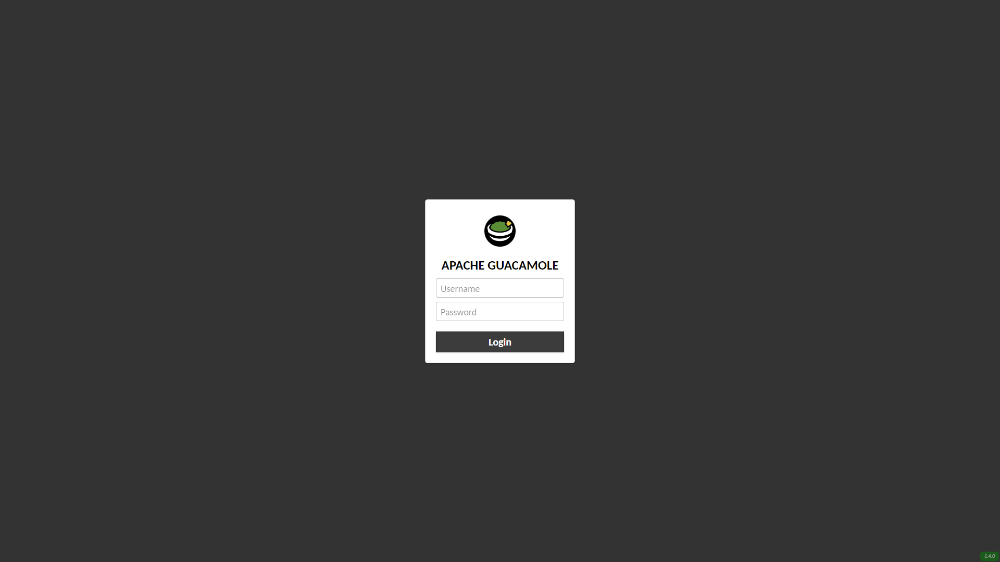

# guacamole-dark-theme-extension

This extension is created for [Apache Guacamole](https://guacamole.apache.org/). \
Extension changes login, logout, home and settings page styles and **does not** alter any other aspects and functions of the server. \
This extension is based on [madmath03's Guacamole design](https://github.com/madmath03/dark-guacamole) with some tweaks and improvements, this extension eliminates the need to install external style or any kind of browser add-on on devices accessing this site. 

## Usage & Installation
Cd into the Guacamole extensions folder.
In most cases the default Guacamole extension folder will be in `/etc/guacamole/extensions` (when using docker you need to find the `/data` or `/config` folder, then `/guacamole/extensions`).

Download file `guacamole-dark-theme-extension.jar`. 

```
wget https://github.com/LagManCZ/guacamole-dark-theme/raw/master/guacamole-dark-theme-extension.jar
```
Restart Guacamole. \
Go to Guacamole web, and it should be in dark themed design.

### Small preview


### Contributions
If you found a bug or have something to add to this extension, feel free to use the issue tracker or pull request.

### License
This extension is released under the [**MIT**](LICENSE.md) license.